### Problem Statement:

The use of technology as a means of social interaction has increased greatly over the years.  There are many ways for people to meet professionally, socially, and romantically.  Once a stigma, social media and dating websites are now an increasingly mainstream and accepted practice.  The pandemic of 2020 has likely catapulted online dating into commonplace. To make online dating a more successful venue for meeting partners, it is important to explore the ideas and preferences of those using technology to find romantic relationships.
In this study we would like to answer the following questions:
Does location impact the online dating experience for someone?
How safe is online dating in comparison to meeting someone in person?
Does meeting online have anything to do with the success of a relationship?
How does age impact views and experiences on online dating?
Through what online platforms are people meeting?
Why is it both easier and more difficult to date now than it was 10 years ago?
How has technology influenced ending a relationship?
We will also build a linear regression model to see if we can predict the years in a relationship based on phone and internet usage.  We’ll evaluate success of the model on the R2 scores on both the training data and testing data.  We’ll also look and interpret the coefficients to see how each of our features affect the years of a relationship.

 ### Methodology:

The datasets we are using were compiled by the Pew Research Center titled “American Trends Panel Wave 56” from October 2019.  According to the Pew Research Center, “These findings are based on a survey conducted Oct. 16-28, 2019, among 4,860 U.S. adults. This includes those who took part as members of Pew Research Center’s American Trends Panel (ATP), an online survey panel that is recruited through national, random sampling of residential addresses, as well as respondents from the Ipsos KnowledgePanel who indicated that they identify as lesbian, gay or bisexual (LGB). (https://www.pewsocialtrends.org/2020/08/20/methodology-38/) In this study, there were 61 questions on dating preferences, privacy, harassment, challenges, benefits, and experiences with online dating.

To analyze the sentiment toward using technology in romantic relationships, we dropped the columns that used the following information: Interview Start Time,  Interview End Time,  Device Type, Form Type, Partner Sex,  Orientation, Metro, Region, Population Demographic,  Age Category,  Sex, Education Levels, Race, Country Born, Citizen of US, Marital Status,  Religion, Born-Again Christian,  Attend Church,  Political Party Affiliation, Income, Party Registered to Vote, Political Ideology, How Internet Accessed.  Deleting this information removes any bias of demographics in analysis.  We also dropped rows (12) if the respondent answered “Refused to Answer” about their relationship status and age.

We also used  “Internet & American Life Project Spring Tracking”, 2013 from the Pew Research Center.  This survey was conducted Apr. 17 - May 19, 2013, among 2,250 U.S. adults (18+).  The results of this survey were used by the Pew Research Center’s Internet and American Life Project, which was looking at the impact of the internet on people’s lives.

Data Cleaning for Linear Regression Model:

Filtered the dataset to get all the respondents that said they were married, then saved it as its own dataset. And repeated this for respondents that said they were living together and those respondents that were in a committed relationship.
Concatenated all three datasets to make one dataset for the respondents in a current relationship.
Dropped all columns that were questions unrelated to the internet usage, phone usage, or online dating.  Also, dropped columns that asked similar questions and decided to keep the column with less missing values.
Decided to impute missing/null values by adding them to the ‘no’ answers because the missing values indicated that they were not asked this question because of their response to a previous question.
Dropped all rows with ‘Don’t Know’ and ‘Refused’ responses.
Also, converted all of the numbers from strings to integers.

Data Analysis and Findings

Online dating is shown to be one of the most popular ways nowadays to find dates. For the participants in the PEW study, one out of every 6 people met their partner online.  Further analysis, indicates that online dating is the primary way LGB couples meet, and the fourth most popular way heteresexual couples meet(Figure).

With regard to a committed relationship status,  those who were ‘divorced’, ‘living with a partner’, or ‘widowed’ met their current partners through friends and family or online, evenly split.  The majority of those who were ‘married’ met their spouse through family and friends.  Those who have ‘never been married’ and in a relationship or those ‘separated’ met their current partner online, by a large majority.
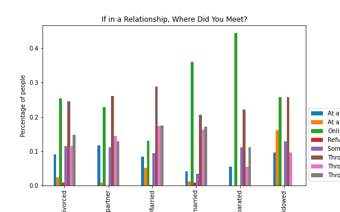

If the respondents indicated they met online, they were asked what platform they used.  All relationship categories, except for the ones identified as ‘separated’, met on a dating app.  Those who were ‘separated’ indicated they met through ‘an online discussion forum’.
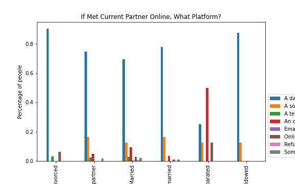

Next, individuals were asked if it is more difficult or easier to date now than it was 10 years ago. For those who answered that it was more difficult,  the ‘divorced’, ‘living with a partner’, ‘and ‘married’ cited trust issues as the main factor.  ‘Widowed’ were split evenly between trust issues and other reasons.  The ‘never been married’ and ‘separated’ gave many reasons.

Of the individuals who said it was easier to date now than it was 10 years ago, all groups cited ‘technology’ and ‘easier to meet people’ as their main answers.
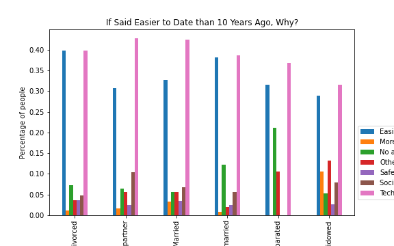

Regarding trust in a potential partner, individuals were asked if they ever searched for information online about someone in whom they were romantically interested.  Over 50% of those who identified ‘divorced’, ‘living with a partner’, and ‘never been married’ had checked online for information.  The majority of those who were ‘married’ and ‘divorced’  had not checked for information.  ‘Separated’ individuals were split almost in half.
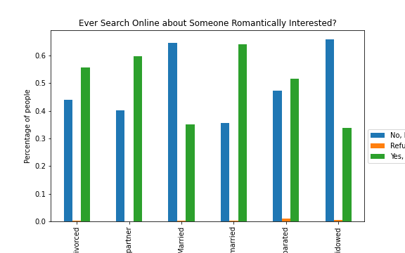

Respondents were asked about  ways to end a ‘committed ‘ relationship and if they were acceptable.  The first question asked if it was acceptable to break up in person and majority of all groups answered ‘always’.  The next question asked if breaking up through a phone call and the majority of all groups answered ‘sometimes’, followed by ‘never’ and ‘rarely’.    Then the respondents were asked if it was acceptable to break up by ‘text’, ‘private message’, and ‘email’ and the majority of answers in all groups was ‘never’.

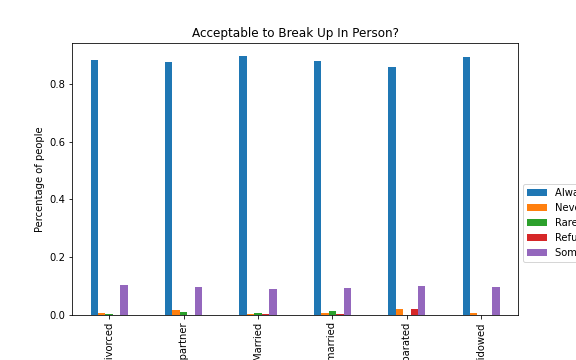
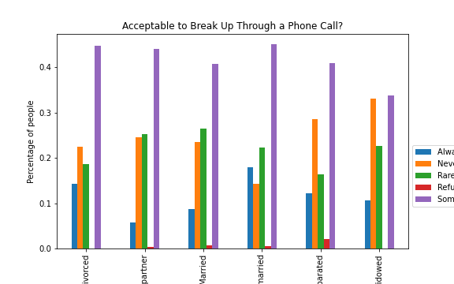

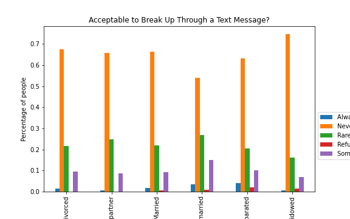
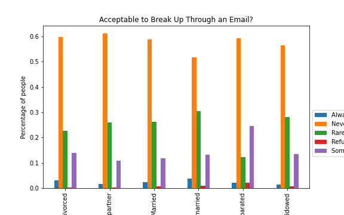

When analyzing the experiences of online daters, location seems to be an important factor. People in less populous areas reported more often feelings of frustration and insecurity and also pointed out their dissatisfaction because of the limited number of people around them.  Online daters in other regions of the U.S. reported more often feeling  hopeful, and optimistic. Also, online daters in rural areas indicated more concerns over privacy violations and people setting fake accounts. (Figure)

In regards to harassment, based on the survey results, the number of  online daters who reported to have experienced some type of harassment was 10% higher than non online daters. When looking at the difference between men and women, 62.7% women online daters said  they have experienced harassment in their dates while  52.4% men reported the same . (Figure)
 listed “others are not interested in me” as a major reason that they have not found a partner.

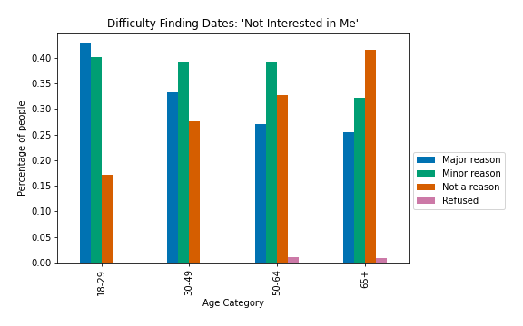

As mentioned above, safety is a big issue with online dating. We talked about women vs men being harassed through online dating. We also found that about 60% of people 18-29 years old listed receiving unsolicited explicit images through a dating app as very common compared to only about 15% of people 65 years or older.
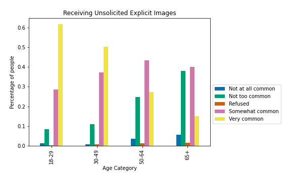

Modeling
Used a Linear Regression model to predict how many years have couples been in a relationship.
Target:
Mar3: How many years have you been married or in your current relationship?

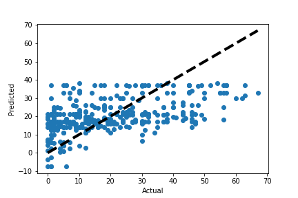

Features Used:
Rel1: Is your spouse/current partner someone you first met online or offline? 1 = Met online, 2 = Met offline
Intmob: Do you access the internet on a cell phone, tablet or other mobile handheld device, at least occasionally? 1 = Yes, 2 = No
Act87: Do you ever use the internet to use a social networking site like Facebook, LinkedIn, or Google Plus? 1 = Yes, 2 = No
Act112: Do you ever use the internet to use Twitter? 1 = Yes, 2 = No
Act130: Do you ever use the internet to use Reddit? 1 = Yes, 2 = No
Q10b: Do you have a tablet computer like an iPad, Samsung Galaxy Tab, Google Nexus, or Kindle Fire? 1 = Yes, 2 = No
Cellphn: Do you have a cell phone? 0 = Yes, 1 = No
Q11b: Have you used a cell phone to download apps? 1 = Yes, 2 = No
Q11c: Have you used a cell phone to access the internet? 1 = Yes, 2 = No
Q11d: Have you used a cell phone to participate in a video call or chat? 1 = Yes, 2 = No
Q11f: Have you used a cell phone to send or receive text messages? 1 = Yes, 2 = No
Rel2: Did you meet (your partner) through an online dating site or some other way? 1 = Met through online dating site, 2 = Some other way
Date1a: Have you ever used an online dating site such as Match.com, eHarmony, or OK Cupid? 1 = Yes, 2 = No
Date2a: Have you ever used a dating app on your cell phone? 1 = Yes, 2 = No

Results
Model training score: 0.28
Model test score: 0.26
[figure ‘actual_pred.png’]

Conclusions
Because of the popularity of online dating, as shown in the results of our study, it is likely more helpful for minority communities who may have had more limited options. Also, the fact that online dating is becoming very common, may indicate that it is replacing the traditional way of meeting someone through  friends and family. This would be an important change in people’s behaviour.

As online dating grows people will be more likely to find a partner and have an easier time doing so than before, but that does not mean online dating is all positive. As we discussed, younger people have a harder time on online dating apps because they are more likely to receive unsolicited explicit images, more likely to be ghosted on dates, and online dating can also impact the way they think of themselves. Those negative effects of online dating can also extend to an older crowd that has never been exposed to this medium before.

Although people are meeting more online and entering into committed relationships, married individuals indicate that they met their spouses through a friend or family member. If the person in a committed relationship met online, most respondents in each category answered they met on a dating site or app, whereas those who were ‘separated’ said they met on an ‘online discussion forum’.

If those in a committed relationship answered that it was more difficult to date now than it was 10 years ago, those ‘divorced’, ‘living with a partner’, and ‘married’ cited trust issues.  ‘Widowed’ were split between trust issues and ‘other’.  ‘Separated’ and ‘never been married’ individuals answered a variety of issues that were not dominated by trust, likely because they are currently meeting people in what they consider to be a safe manner.  At the same time, more than 50% of those ‘divorced’, ‘living with a partner’ and ‘separated’ have searched online for information on a potential romantic partner.  This further supports the idea that these groups have developed trust issues regarding online dating.

For those who said it was easier to date now than it was 10 years ago, all relationship groups said it was easier for two reasons: it is easier to meet people and technology.  Likely, those two are related as it is easier to meet people because of technology.

On breaking up with someone with whom they are in a committed relationship, all respondents in every relationship category indicated the best way to break is ‘in person’ as opposed to a phone call, text, private message, or email.  Yet in study by e-harmony.com, most people who meet online break via an email(https://www.eharmony.com/online-dating-statistics/).  While people believe that such relationship issues should be dealt with in person, most use technology as a way of avoiding confrontation.

The evaluation metrics for our linear regression tells us that the model performed very poorly on both the training and test data.  This shows that it is very difficult to predict how many years a relationship is based on use of technology.  However, there are some interesting coefficients that our model has produced.

Coefficients Interpretations:
 Holding all else constant:
For people who do not send or receive text messages, we expect the years of the relationship to increase by 11.9 years.
For people have not used an online dating site, we expect the years of the relationship to increase by 11.5 years.
For people who met their spouse/current partner offline, we expect the years of the relationship to increase by 0.002  years.
For people who do not access the internet through a mobile device, we expect the years of the relationship to increase by 1.44 years.
For people who do not use a social networking site like Facebook, we expect the years of the relationship to increase by 3.9 years.
For people who do not use Twitter, we expect the years of the relationship to decrease by 0.3 years.
For people who do not use Reddit, we expect the years of the relationship to increase by 2.9 years.
For people who do not have a tablet computer like an iPad, we expect the years of the relationship to decrease by 1.2 years.
For people who do not have a cell phone, we expect the years of the relationship to increase by 6.8 years.
For people who have not downloaded an app on their phone, we expect the years of the relationship to increase by 1.4 years.
For people who do not access the internet on their phone, we expect the years of the relationship to increase by 2.4 years.
For people who have not participated in a video call on their phone, we expect the years of the relationship to increase by 3.1 years.
For people who did not meet their partner through an online dating site, we expect the years of the relationship to decrease by 4.9 years.
For people who have not used a dating app on their cell phone, we expect the years of the relationship to decrease by 4.9 years.
